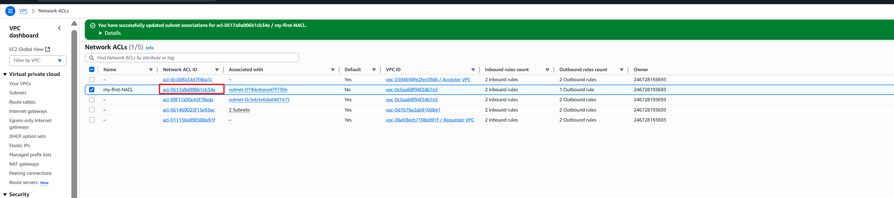
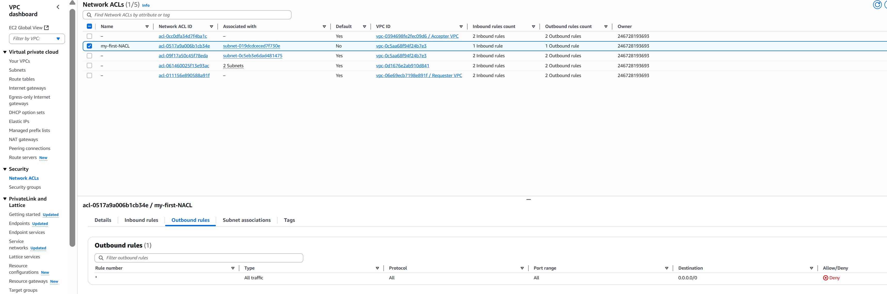

# AWS Security Group and NACL Mini Project

## Project Overview

This project demonstrates hands-on experience with the configuration of AWS Security Groups and Network Access Control Lists (NACLs).  
You will learn how to secure your AWS infrastructure by managing inbound and outbound traffic rules, applying layered network security, and troubleshooting access issues.  
The project uses a sample IP address (`50.18.32.11`) for HTTP access to illustrate practical scenarios.

---

## Table of Contents

1. [Introduction](#introduction)
2. [Prerequisites](#prerequisites)
3. [Step-by-Step Guide](#step-by-step-guide)
   - [1. Launch an EC2 Instance](#1-launch-an-ec2-instance)
   - [2. Configure Security Group](#2-configure-security-group)
   - [3. Configure Network ACL](#3-configure-network-acl)
   - [4. Testing Access](#4-testing-access)
   - [5. Troubleshooting](#5-troubleshooting)
4. [Best Practices](#best-practices)
5. [Conclusion](#conclusion)

---

## Introduction

AWS Security Groups and NACLs are essential for protecting your cloud resources.  
Security Groups act as virtual firewalls for your EC2 instances, while NACLs operate at the subnet level, providing an additional layer of security.  
This documentation provides a step-by-step guide with screenshots to help you understand and implement these features.

---

## Prerequisites

- An AWS account
- Basic knowledge of AWS Management Console
- EC2 instance launched in a VPC

---

## Step-by-Step Guide

### 1. Launch an EC2 Instance

- In the AWS Console, navigate to **EC2** and click **Launch Instance**.
- Select an Amazon Machine Image (AMI), and choose instance type.
- Configure instance details and subnet as needed.

---

### 2. Configure Security Group

- Under **Configure Security Group**, create a new security group or select an existing one.
- Add an **HTTP rule**:
  - Type: HTTP
  - Protocol: TCP
  - Port Range: 80
  - Source: `50.18.32.11/32`

- Add other necessary rules (e.g., SSH for admin access).
- Review and launch the instance.

---

### 3. Configure Network ACL

- Go to **VPC** > **Network ACLs**.
- Select the NACL associated with your subnet.
- Edit **Inbound Rules**:
  - Rule #: Choose an appropriate number (lowest takes precedence)
  - Type: HTTP
  - Protocol: TCP
  - Port Range: 80
  - Source: `50.18.32.11/32`
  - Allow/Deny: **ALLOW**

- Edit **Outbound Rules** as required for return traffic:
  - Allow outbound HTTP responses.

---

### 4. Testing Access

- After configuring the rules, test access from the IP `50.18.32.11` using a browser or `curl`.
- Successful access confirms proper rule setup.

---

### 5. Troubleshooting

- If access is denied:
  - Double-check both Security Group and NACL rules.
  - Ensure no conflicting DENY rules in the NACL.
  - Confirm rule priorities (lowest rule number takes effect for NACL).
  - Check instance health and public IP address.

---

## Best Practices

- Use the principle of least privilege for all security group and NACL rules.
- Regularly audit and review inbound/outbound rules.
- Document all changes for compliance and rollback.
- Pair Security Groups (stateful) with NACLs (stateless) for layered security.

---

## Conclusion

By following this guide, you have learned to:
- Secure AWS EC2 instances with Security Groups and NACLs.
- Allow HTTP access specifically from `50.18.32.11`.
- Troubleshoot and verify connectivity.
- Apply best practices for AWS network security.

This hands-on project strengthens your understanding of cloud security fundamentals and prepares you for advanced AWS networking scenarios.

---
# Security-Group-and-NACL
Mini Project

4. If you selected the Network ACL you created,

a) navigate to the "Inbound" tab.

By default, you'll notice that it's denying all traffic from all ports.

Similarly, if you look at the outbound rules, you'll observe that it's denying all outbound traffic on all ports by
default.
b) Select the NACL.
c) And navigate to the "Outbound" tab.

5. To make changes,
a) select the NACL,
b) Go to the "Inbound" tab.
c) And click on "Edit inbound rules".

7. Now, choose the rule number.
a) Specify the type.
b) Select the source.
c) And determine whether to allow or deny the traffic.
d) Then click on "Save changes."

8. Let's associate it.
a) Select your NACL.
b) Click on "Actions."
c) Choose "Edit subnet association."
aws
Services
Q Search
[Alt+S]

Once selected, you'll see it listed under "Selected subnets".
e) Finally, click on "Save changes".

You have successfully associated your public subnet to this NACL.

As soon as you have attached this NACL to your public subnet, and then you try to access the website again by
typing the URL http://54.255.228.191/, you will notice that you are unable to see the website.

Although we've permitted all traffic in the inbound rule of our NACL, we're still unable to access the website. This
raises the question: why isn't the website visible despite these permissions?

The reason why we're unable to access the website despite permitting inbound traffic in the NACL is because
NACLs are stateless. They don't automatically allow return traffic. As a result, we must explicitly configure rules
for both inbound and outbound traffic.

Even though the inbound rule allows all traffic into the subnet, the outbound rules are still denying all traffic.

You can see,

9. If we allow outbound traffic as well,

a) Choose you NACL.

b) Go to outbound tab.

c) Click on "Edit outbound rules."

click add rules

e) Duplicate the process you followed for creating the inbound rules to establish the outbound rules in a similar
manner.

You have successfully created the rules

Now, let's see one more interesting scenario,

In this scenario:

Security Group: Allows inbound traffic for HTTP and SSH protocols and permits all outbound traffic.

Network ACL: Denies all inbound traffic. Let's observe the outcome of this configuration.

Security group,

Configuring it,

NACL,

Let's remove it so by default it be denied all traffic.

So we are unable to access the website. why? Even if we have allowed inbound traffic for HTTP in security group
Imagine you're at the entrance of a building, and there's a security guard checking everyone who wants to
come in. That security guard is like the NACL. They have a list of rules (like "no backpacks allowed" or "no food or
drinks inside"), and they check each person against these rules as they enter.
Once you're inside the building, there's another layer of security at each room's door. These are like the Security
Groups. Each room has its own rules, like "only employees allowed" or "no pets." These rules are specific to each
room, just like Security Groups are specific to each EC2 instance.
So, the traffic first goes through the NACL (the security guard at the entrance), and if it passes those rules, it
then goes through the Security Group (the security check at each room's door). If it doesn't meet any of the rules
along the way, it's denied entry.
The reason we can't see the website is because the NACL has denied inbound traffic. This prevents traffic from
reaching the security group, much like a security guard not allowing entry to another room if access to the
building is denied. Similarly, if someone can't enter a building, they can't access any rooms inside without first
aaining entry to the building."
NACL allows all inbound and outbound traffic, Security Group denies all inbound and outbound traffic:
Outcome: Website access will be blocked because the Security Group denies all traffic, overriding the
NACL's allowance.
NACL denies all inbound and outbound traffic, Security Group allows all inbound and outbound traffic:
Outcome: Website access will be blocked because the NACL denies all traffic, regardless of the Security
Group's allowances.
NACL allows HTTP inbound traffic, outbound traffic is denied, Security Group allows inbound traffic and
denies outbound traffic: Outcome: Website access will be allowed because the Security Group allows HTT
inbound traffic, regardless of the NACL's allowances. However, if the website requires outbound traffic to
function properly, it won't work due to the Security Group's denial of outbound traffic.
NACL allows all inbound and outbound traffic, Security Group allows HTTP inbound traffic and denies
outbound traffic: Outcome: Website access will be allowed because the Security Group allows HTTP
inbound traffic, regardless of the NACL's allowances. However, if the website requires outbound traffic to
function properly, it won't work due to the Security Group's denial of outbound traffic.
NACL allows all inbound and outbound traffic, Security Group allows all inbound and outbound traffic:
• NACL allows all inbound and outbound traffic, Security Group allows all inbound and outbound traffic:
Outcome: Website access will be allowed, as both NACL and Security Group allow all traffic.
• NACL denies all inbound and outbound traffic, Security Group allows HTTP inbound traffic and denies
outbound traffic: Outcome: Website access will be blocked because the NACL denies all traffic, regardless of
the Security Group's allowances.
Project Reflection:
• Successfully configured Security Groups and NACLs to control inbound and outbound traffic in AWS.
• Identified the differences between Security Groups and NACLs and their respective roles in network security.
• Explored various scenarios to understand how Security Groups and NACLs interact and impact network
traffic.
• Learned valuable troubleshooting techniques for diagnosing and resolving network connectivity issues in
AWS.
• Overall, gained practical experience and confidence in managing network security within AWS
environments.
