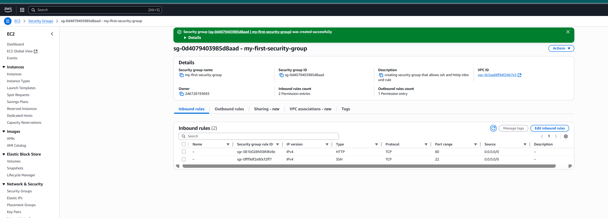
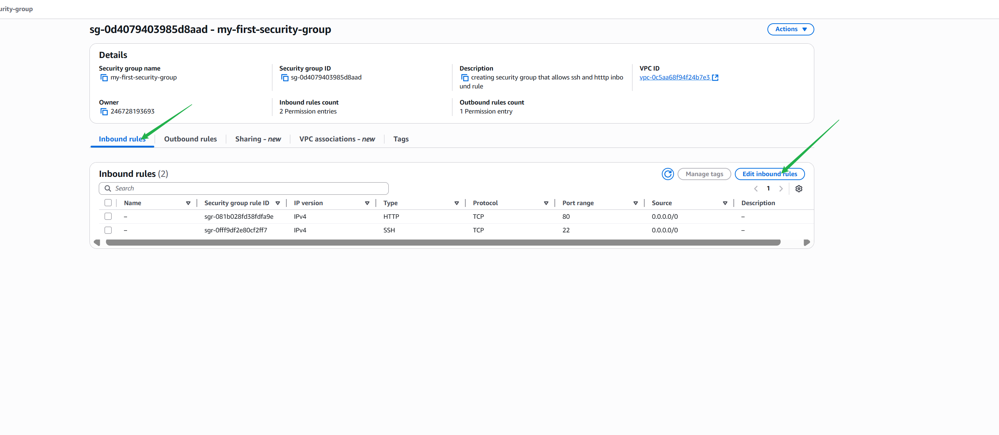
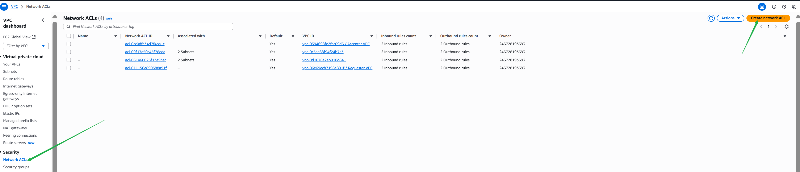

# AWS Security Group and NACL Mini Project

## Project Overview

This mini project demonstrates hands-on experience configuring AWS Security Groups and Network Access Control Lists (NACLs) for cloud network security.  
You will learn how to control inbound and outbound traffic, layer network security, and troubleshoot access issues using step-by-step instructions and explicit screenshots.

---

## Table of Contents

1. [Introduction](#introduction)
2. [Prerequisites](#prerequisites)
3. [Step-by-Step Guide](#step-by-step-guide)
   - [1. Launch an EC2 Instance](#1-launch-an-ec2-instance)
   - [2. Configure Security Group](#2-configure-security-group)
   - [3. Configure Network ACL](#3-configure-network-acl)
   - [4. Associate NACL with Subnet](#4-associate-nacl-with-subnet)
   - [5. Testing Access](#5-testing-access)
   - [6. Troubleshooting](#6-troubleshooting)
   - [7. Scenario Exploration](#7-scenario-exploration)
4. [Best Practices](#best-practices)
5. [Reflection and Learning](#reflection-and-learning)
6. [Conclusion](#conclusion)
7. [Screenshots Reference](#screenshots-reference)

---

## Introduction

AWS Security Groups act as virtual firewalls for your EC2 instances, while NACLs operate at the subnet level to provide a second layer of security.  
This documentation offers an explicit, step-by-step guide illustrated with screenshots to help you understand and implement these features.

---

## Prerequisites

- AWS account
- Basic knowledge of AWS Console
- EC2 instance launched in a VPC

---

## Step-by-Step Guide

### 1. Launch an EC2 Instance

- In AWS Console, go to **EC2** > **Launch Instance**.
- Select an Amazon Machine Image (AMI) and instance type.
- Set up instance details and subnet as needed.

---

### 2. Configure Security Group

- Create or select a Security Group during launch.
- Add an **HTTP rule** to allow traffic from a specific IP (`50.18.32.11/32`):
  - Type: HTTP, Protocol: TCP, Port: 80, Source: `50.18.32.11/32`
- (Optional) Add **SSH** rule for admin access.

---

### 3. Configure Network ACL

- Go to **VPC** > **Network ACLs**.
- Select the NACL for your subnet.
- Set **Inbound Rules** to allow HTTP from `50.18.32.11/32`.
- Set **Outbound Rules** for HTTP responses.

---

### 4. Associate NACL with Subnet

- Select your NACL.
- Click **Actions** > **Edit subnet association**.
- Choose the public subnet.

---

### 5. Testing Access

- Access your EC2 instance from `50.18.32.11` using a browser or `curl`.
- If rules are set up correctly, the connection should succeed.

---

### 6. Troubleshooting

- If access fails:
  - Check Security Group and NACL rules for mistakes or conflicts.
  - Ensure inbound and outbound rules are set correctly.
  - Verify rule priorities (NACL's lowest rule number takes precedence).
  - Check EC2 health and public IP.
  - Understand that NACLs are stateless—return traffic must be explicitly allowed.

---

### 7. Scenario Exploration

**NACL and Security Group Interactions:**
- *NACL denies all inbound, Security Group allows inbound*: Website access blocked.
- *NACL allows all, Security Group denies all*: Website access blocked.
- *NACL allows HTTP inbound, denies outbound; Security Group allows inbound, denies outbound*: Website works for inbound HTTP, fails for outbound requirements.
- *Both allow all*: Website access works.

*Analogy:*  
NACL is like a security guard at the building entrance; Security Group is the room’s door check. Both must allow traffic for access.

---

## Best Practices

- Follow principle of least privilege.
- Regularly audit rules.
- Document all changes.
- Use layered security: Security Groups (stateful) + NACLs (stateless).

---

## Reflection and Learning

- Configured Security Groups and NACLs for AWS network control.
- Explored their differences and roles.
- Tested scenarios to see real-world effects.
- Practiced troubleshooting network connectivity.
- Gained confidence in AWS network security management.

---

## Conclusion

By following this guide, you should be able to:
- Secure EC2 instances using Security Groups and NACLs.
- Allow HTTP access from specific IPs.
- Troubleshoot and verify connectivity.
- Apply best practices for AWS security.

---

## Screenshots Reference

All screenshots used in this guide can be found in the `images/` directory.  
**Below are all screenshots from `images/soc1.png` to `images/soc39.png`, included for explicit step-by-step visual reference:**

---

**End of Guide**
